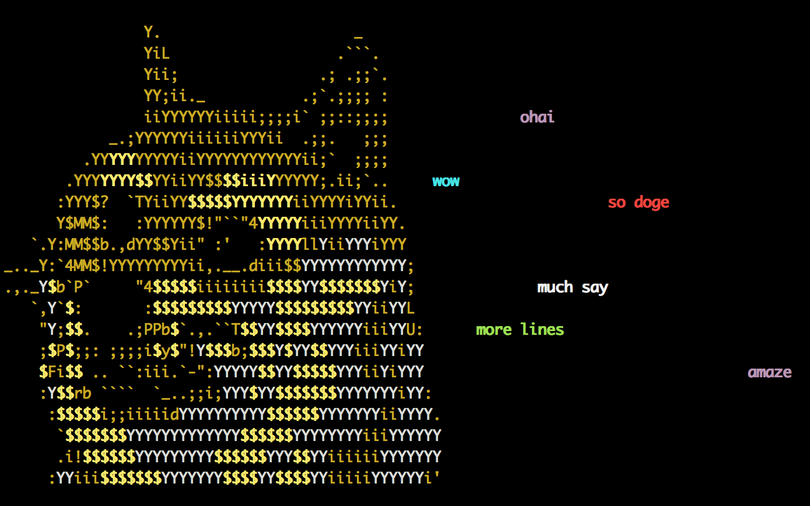

# dogesay

> Say it with doge



## Install

```sh
npm install -g dogesay
```

## Use

```sh
echo "wow\n\nso amaze" | dogesay
```

`dogesay` will print up to 16 lines of text. It works best if each line is a short phrase.

---

MIT © Kevin Lanni
